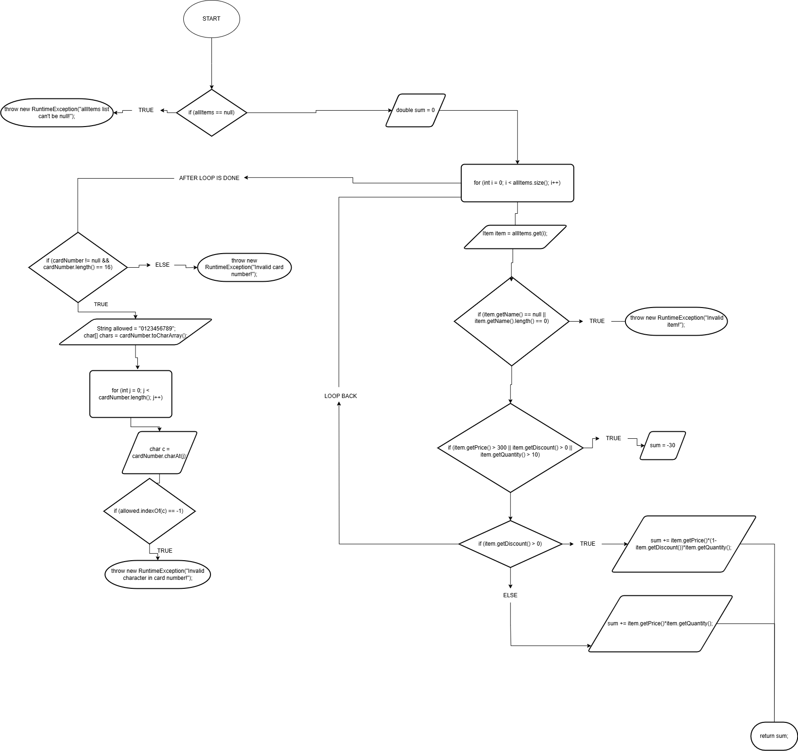

# SI_2025_lab2_212125

# 2. url od slikata

# 3. CC
Цикломатската сложеност (CC) на методот checkCart е 9.
Ова се пресметува со броење на 8 точки на одлучување (if, for) и примена на формулата:
CC = 8 + 1 = 9.
Ова значи дека има 9 независни патеки, така што потребни се најмалку 9 тест случаи за целосно покривање на гранките.

# 4. Тестови Стејтмент
Тест 1: Валиден артикл и валидна картичка
allItems: 1 артикл со име „apple“, цена 100, попуст 0, количина 2

cardNumber: "1234567812345678"

→ Сите редови се опфатени освен ако тоа се однесува на попуст или казни за голема вредност.

Тест 2: Артиклот активира попуст и казна
allItems: 1 артикл со цена 350, попуст 0,2, количина 2

cardNumber: "1234567812345678"

→ Ја опфаќа гранката каде што се активира сума -= 30 и логиката за попуст.

Тест 3: Невалиден број на картичка
allItems: валиден артикл

cardNumber: "1234abcd56789012"

→ Го активира RuntimeException во јамката за валидација на картичката.

# 5. Тестови Пат

# if (item.getPrice() > 300 || item.getDiscount() > 0 || item.getQuantity() > 10) 

A (price > 300)	B (discount > 0)	C (quantity > 10)	Резултат  
F	              F	              	F	              	F
T	              F	              	F	              	T
F	              T	              	F	              	T
F	              F	              	T	              	T
T	              T	              	F	              	T
T	              F	              	T	              	T
F	              T		              T	              	T
T		            T		              T	              	T

Минимум 8 тестови

Примери:
FFF: price = 100, discount = 0, quantity = 2

TFF: price = 400, discount = 0, quantity = 2

FTF: price = 100, discount = 0.1, quantity = 2

FFT: price = 100, discount = 0, quantity = 20

TTF: price = 400, discount = 0.1, quantity = 2

TFT: price = 400, discount = 0, quantity = 20

FTT: price = 100, discount = 0.1, quantity = 20

TTT: price = 400, discount = 0.1, quantity = 20

